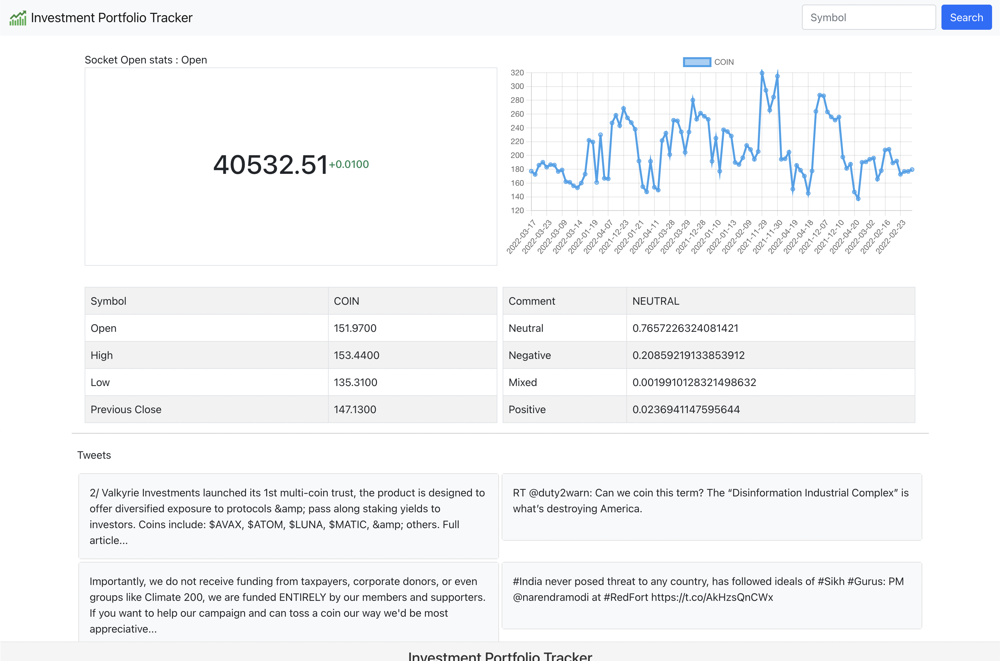
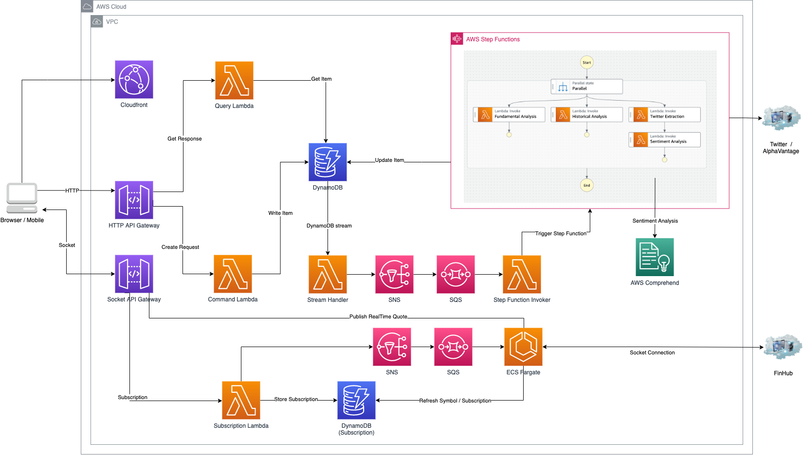

# Repository for Investment Portfolio Tracker

### Application Screen

### Architecture Diagram

## AWS Component
\#      | Site                  | Usage
------- | -------               | -------
| 1     | AWS API Gateway       | HTTP API / Socket API
| 2     | Lambda                | Serverless short-live compute 
| 3     | DynamoDB              | Store the request symbol / subscription
| 4     | SNS/SQS               | Service Integration component
| 5     | Cloudfront            | Frontend Webserver
| 6     | S3                    | Client side artifact
| 7     | ECR                   | ECR for fargate image repository
| 8     | ECS                   | Fargate instance to handle real time feed subscription
| 9     | Step function         | State machine to crawl stock information
| 10    | AWS Comprehend        | Sentiment Analysis on live twitter feed

## External API 
\#      | Site                  | Usage
------- | -------               | -------
| 1     | AlphaVantage          | Stock Data APIs
| 2     | Twitter               | Live Twitter tweet